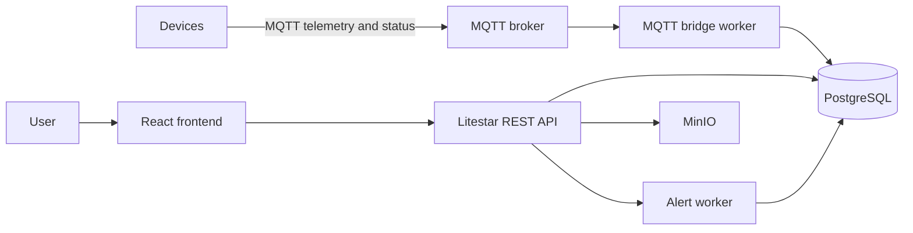

# Techbiome

Techbiome is an IoT monitoring and device-management platform. It combines a Litestar backend, a React/Vite frontend, a PostgreSQL database, an MQTT broker, and background workers that move telemetry, commands, and alert state through the system.

## What it does

- Tracks devices in a registry and stores their status.
- Ingests telemetry and keeps the latest readings plus history.
- Queues device commands and marks them delivered through the MQTT bridge.
- Maintains firmware metadata and queues OTA deploy commands.
- Evaluates alert rules against telemetry and records alert instances.
- Exposes a browser UI for operational monitoring.

## Repo Layout

- [backend/README.md](backend/README.md) explains the API, workers, and data model.
- [frontend/README.md](frontend/README.md) explains the UI routes and frontend structure.
- [docs/architecture.md](docs/architecture.md) gives the system-wide flow.
- [docs/data-model.md](docs/data-model.md) summarizes the main database tables.
- [docs/security.md](docs/security.md) documents trust boundaries, certificate flow, and ingress policy.
- [docs/c4/index.c4](docs/c4/index.c4) contains the architecture model used for C4 diagrams.

## Local Development

Use Docker Compose for the full stack:

```powershell
docker compose up --build
```

Then open:

- Frontend: http://localhost:5173
- Backend API: http://localhost:8000
- MinIO API: http://localhost:9000
- MinIO Console: http://localhost:9001

If you only want one subsystem, see the backend and frontend READMEs for direct run instructions.

## How To Set It Up

1. Install Docker Desktop so you can run the full stack locally.
2. Clone the repository and open it in VS Code.
3. Run `docker compose up --build` from the repository root.
4. Wait for PostgreSQL, the MQTT broker, MinIO, the backend API, and the frontend to finish starting.
5. Open http://localhost:5173 in your browser.
6. If you want to work on one part directly, follow the package-specific instructions in [backend/README.md](backend/README.md) or [frontend/README.md](frontend/README.md).

## How To Contribute

The simplest way to contribute is to keep changes small and update the docs alongside the code.

1. Read the relevant subsystem README before making changes.
2. Make the smallest focused change that solves the problem.
3. Run the relevant validation step for the area you touched, such as `docker compose up --build`, `npm run build`, or the backend run command from [backend/README.md](backend/README.md).
4. Update or add documentation when behavior changes.
5. Keep comments short and only add them where the control flow is genuinely hard to follow.
6. If you introduce a new API, table, page, or worker, document what it does and how it fits into the platform.

## High-Level Architecture



The detailed C4 source lives in [docs/c4/index.c4](docs/c4/index.c4).
