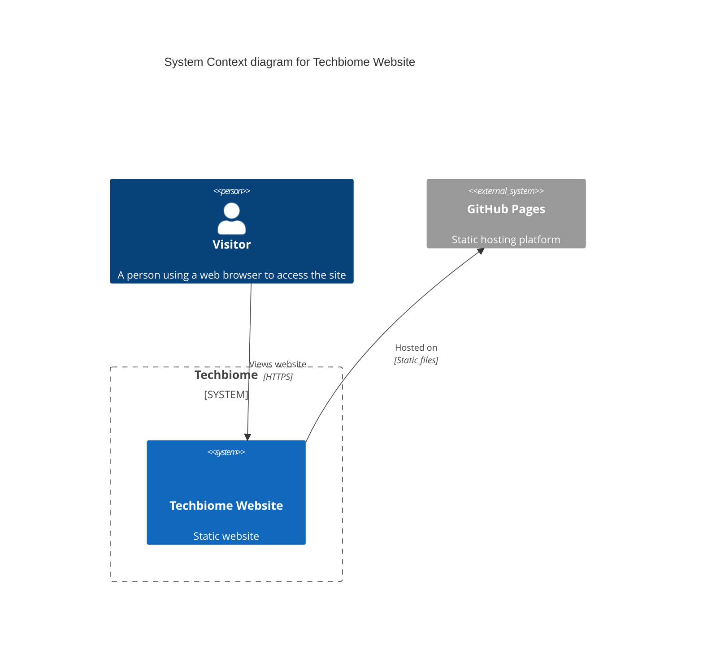
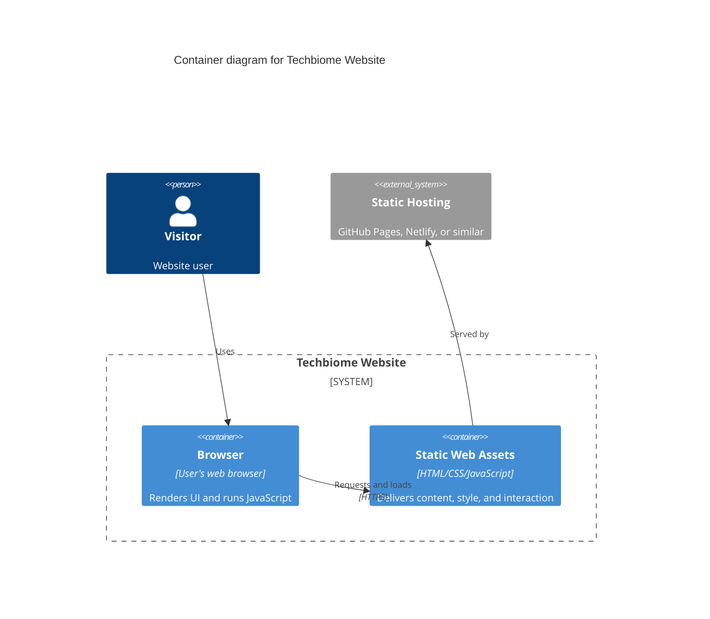
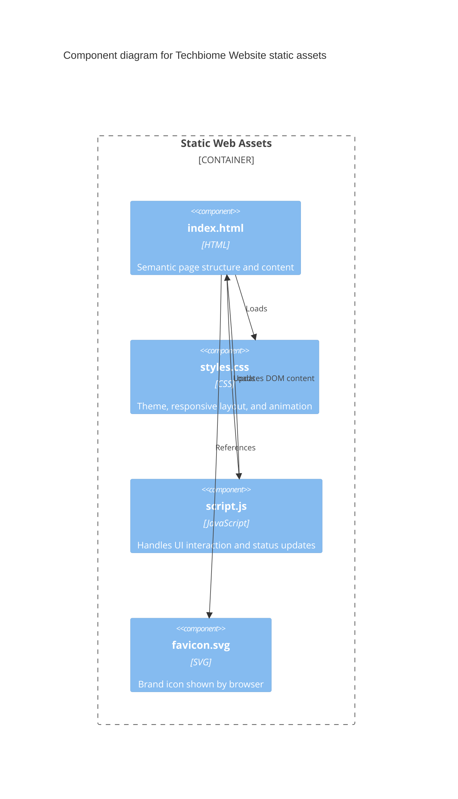

# Techbiome Website Starter

A clean, responsive starter website using plain HTML, CSS, and JavaScript.

## Files

- `index.html`: Main page and semantic structure
- `styles.css`: Theme, layout, responsive rules, and animations
- `script.js`: Basic interactive behavior
- `favicon.svg`: Site icon
- `.gitignore`: Standard ignore rules
- `docs/c4/context.mmd`: C4 System Context source
- `docs/c4/container.mmd`: C4 Container source
- `docs/c4/component.mmd`: C4 Component source

## Run Locally

Open `index.html` directly in your browser.

## Customize

1. Replace text content in `index.html`.
2. Adjust theme colors and typography in `styles.css`.
3. Add features in `script.js`.

## C4 Architecture Model

These Mermaid C4 diagrams render in Markdown viewers that support Mermaid C4 syntax, including GitHub.

### 1. System Context

### 2. Container

### 3. Component

Source files for these diagrams are in `docs/c4/`.
