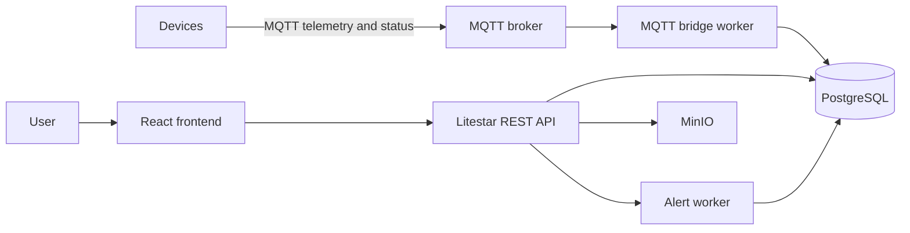

# Techbiome

Techbiome is an IoT monitoring and device-management platform. It combines a Litestar backend, a React/Vite frontend, a PostgreSQL database, an MQTT broker, and background workers that move telemetry, commands, and alert state through the system.

## What it does

- Tracks devices in a registry and stores their status.
- Ingests telemetry and keeps the latest readings plus history.
- Queues device commands and marks them delivered through the MQTT bridge.
- Maintains firmware metadata and queues OTA deploy commands.
- Evaluates alert rules against telemetry and records alert instances.
- Exposes a browser UI for operational monitoring.

## Repo Layout

- [backend/README.md](backend/README.md) explains the API, workers, and data model.
- [frontend/README.md](frontend/README.md) explains the UI routes and frontend structure.
- [docs/architecture.md](docs/architecture.md) gives the system-wide flow.
- [docs/data-model.md](docs/data-model.md) summarizes the main database tables.
- [docs/c4/index.c4](docs/c4/index.c4) contains the architecture model used for C4 diagrams.

## Local Development

Use Docker Compose for the full stack:

```powershell
docker compose up --build
```

Then open:

- Frontend: http://localhost:5173
- Backend API: http://localhost:8000
- MinIO API: http://localhost:9000
- MinIO Console: http://localhost:9001

If you only want one subsystem, see the backend and frontend READMEs for direct run instructions.

## High-Level Architecture



The detailed C4 source lives in [docs/c4/index.c4](docs/c4/index.c4).
